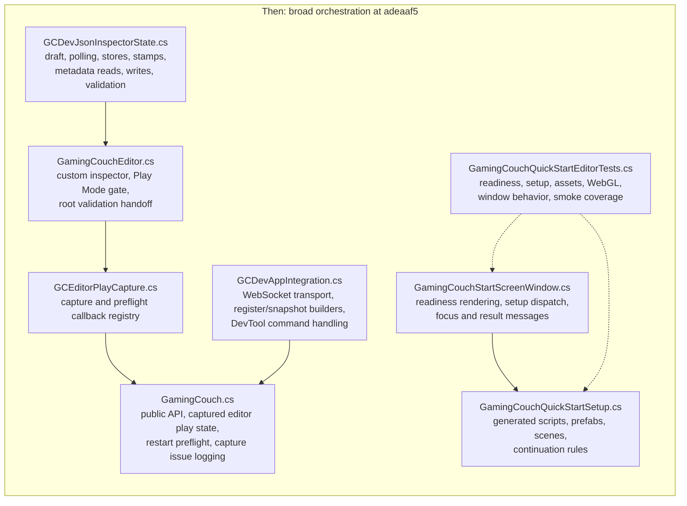
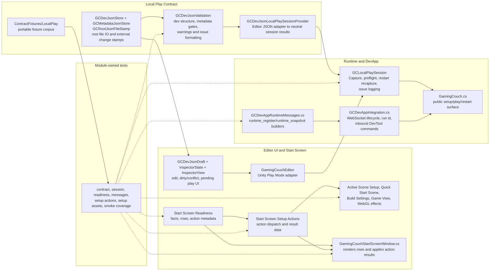

# Gaming Couch Unity Package Architecture: Then And Now

Status: Architecture reference
Last updated: 2026-05-15
Scope: `adeaaf5` (`Update quick-start unified asset validation`) to `bcca403` (`Split editor test harness by module`)

## Purpose

Show how the Unity package architecture moved from broad orchestrators toward smaller modules around the **Local Play Contract**, **Capture**, **Start Screen Readiness**, **Active Scene Setup**, **Quick Start Scene** creation, DevApp runtime messages, and module-owned tests.

The useful pattern is:

> Extract decisions and data contracts into small pure-ish modules; leave Unity side effects and transport in thin adapters/orchestrators; make tests follow the same module boundaries.

## Source Artifacts

- `<this-repo>/CONTEXT.md`
- `<this-repo>/docs/architecture/unity-dev-json-sync-implementation-tasks.md`
- `<this-repo>/docs/architecture/gamingcouch-unity-architecture-improvement-roadmap.md`
- `<gc-client>/docs/prd/gaming-couch-unity-dev-json-sync-prd.md`

## Then

At `adeaaf5`, the package already had the JSON sync feature, but many ownership boundaries were still wide. File IO, validation, draft state, Play Mode gates, setup action dispatch, runtime message construction, and editor tests were concentrated in a few broad files.

## Now

Now the package keeps Unity side effects in editor/runtime adapters, but the decisions and data contracts sit behind deeper module interfaces. JSON-backed Local Play Contract behavior is Editor-owned; Runtime keeps only the Local Play Session seam.

## Responsibility Movement

| Concern | Then owner | Now owner | Pattern |
| --- | --- | --- | --- |
| Root `gc.dev.json` IO | `GCDevJsonInspectorState.cs` held `GCDevJsonStore` inline. | `Editor/GCDevJsonStore.cs` and `Editor/GCDevJsonFile.cs`. | Move file contract behavior out of inspector state and keep JSON dependencies editor-only. |
| Root `gc.metadata.json` IO | `GCDevJsonInspectorState.cs` held `GCMetadataJsonStore` inline. | `Editor/GCMetadataJsonStore.cs` and `Editor/GCMetadataJsonFile.cs`. | Keep metadata as a light-read contract input, not a second settings store. |
| File change detection | `GCDevJsonInspectorState.cs` held `GCRootJsonFileStamp` inline. | `Editor/GCRootJsonFileStamp.cs`. | Share root file polling primitives without making inspector state own them or Runtime carry JSON file IO. |
| Structure and metadata gates | Validation existed, but store/state ownership was mixed with the inspector. | `Editor/GCDevJsonValidation.cs` validates `gc.dev.json`, metadata warnings, entry gates, seat counts, seed rules, and bot warnings. | Keep contract decisions near the contract and out of Runtime. |
| Inspector draft state | Draft classes lived inside `GCDevJsonInspectorState.cs`. | `Editor/GCDevJsonDraft.cs` plus `GCDevJsonInspectorState.cs`. | Separate editable model from state machine and view. |
| Play/restart preflight and Capture | `GamingCouch.cs`, `GamingCouchEditor.cs`, `GCEditorPlayCapture.cs`, and `GCEditorPlayJsonCapture.cs` shared capture/preflight work. | `Runtime/Dev/GCLocalPlaySession.cs` owns the neutral seam; `GCDevJsonLocalPlaySessionProvider` in Editor adapts JSON to setup/play payloads. | Put active **Capture** and restart boundaries behind one session module without coupling Runtime to JSON. |
| Runtime setup/play payload shape | Public DTOs stayed stable. | Public DTOs still stay stable: `GCSetupOptions`, `GCPlayOptions`, `GCPlayerOptions`. | Deepen internal modules without changing public payload contracts. |
| Start Screen readiness rows | Readiness facts and window behavior were tightly paired. | `GamingCouchStartScreenReadiness.cs` and `GCStartScreenReadinessService` own **Start Screen Readiness** facts, rows, and action metadata. | Make readiness a queryable model before the window renders it. |
| Start Screen setup action dispatch | `GamingCouchStartScreenWindow.cs` switched over checklist ids and called setup helpers directly. | `GamingCouchStartScreenSetupActions.cs` maps action ids to execution and result display data. | Move decisions out of the EditorWindow; leave the window to render and apply results. |
| Active Scene Setup and Quick Start Scene generated assets | `GamingCouchQuickStartSetup.cs` owned generated scripts, prefabs, scenes, and continuation rules, with broad tests. | Same module owns **Example Assets**, current-scene setup side effects, and **Quick Start Scene** side effects, now called through the action runner and tested by asset-focused tests. | Keep side effects in one setup module, but keep the current-scene path distinct from generated scene creation. |
| DevApp runtime register/snapshot payloads | `GCDevAppIntegration.cs` built payloads and owned transport. | `GCDevAppRuntimeMessages.cs` builds messages and signatures; `GCDevAppIntegration.cs` keeps WebSocket lifecycle and inbound DevTool commands. | Split message construction from transport. |
| Editor tests | `GamingCouchQuickStartEditorTests.cs` was a broad fixture covering many modules. | Focused test files mirror contract, session, readiness, messages, setup actions, assets, and smoke behavior. | Test files follow production module ownership. |

## Reading The Now-State

- `gc.dev.json` is read and written by Editor `GCDevJsonStore`, structurally represented by `GCDevJsonFile`, validated by `GCDevJsonValidation`, edited through `GCDevJsonDraft` and `GCDevJsonInspectorState`, and captured for runtime through the Editor JSON adapter registered with `GCLocalPlaySession`.
- `gc.metadata.json` is read by `GCMetadataJsonStore`, represented by `GCMetadataJsonFile`, validated as warning or gate context, and never written by the Unity package.
- `GCLocalPlaySession` remains in Runtime but depends only on neutral provider, capture, preflight, and issue types. It does not reference Newtonsoft, `JObject`, `JToken`, `GCDevJson*`, or `GCMetadataJson*`.
- **Start Screen Readiness** answers "what is true and what action is available"; Start Screen setup actions answer "what should happen when this action is clicked"; **Active Scene Setup** applies safe setup to the user's current scene and related editor launch settings; **Quick Start Scene** setup creates or opens `GamingCouchQuickStart.unity`.
- The **Quick Start Scene** is not the active-scene setup path. Both paths may reuse the same **Example Assets**, but only Quick Start Scene setup owns generated example scene creation.
- `GCDevAppRuntimeMessages` exists so outgoing `runtime_register` and `runtime_snapshot` payloads can be tested without opening a WebSocket. `GCDevAppIntegration` remains the transport and inbound-command adapter.
- The test harness split is deliberate: each deeper module now has a focused test home, while `GamingCouchQuickStartEditorTests` keeps only cross-module smoke coverage.

## Portability Boundary

This architecture does not extract shared cross-engine implementation code. Portability currently lives in the **Local Play Contract** and **Contract Fixtures**. A future engine adapter should start by implementing that contract and running the same fixture corpus, not by importing Unity internals.
